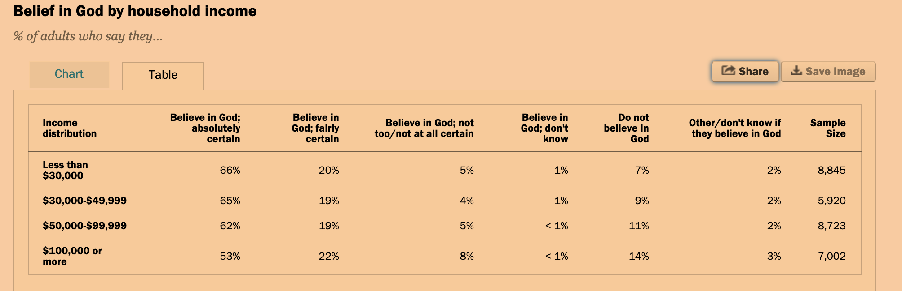

```{r setup, include=FALSE}
knitr::opts_chunk$set(echo = TRUE)
library(readxl)
library(reshape2)
library(xml2)
library(rvest)
library(ggplot2)
library(dplyr)
library(tidyr)
library(stringr)
```

# summary
#### scrape, tidy, clean, analyze, and visualize table with untidy data representing distribution of income across differing degrees of belief in God.

# methods
# scrape table associated with below chart 

```{r}
# load csv approximation of table into memory
raw_data <- read.csv("belief_in_god_by_income.csv", sep = ",")#, check.names = FALSE)
raw_data
```

# initial observations on state of raw data:
* can likely retain semantic value of column headers if change names to likert scale representation (or equivalent qualitative abstraction) of "intensity of belief"
* values in certain columns, like "Believe in God; don't know" contain non-numeric values; round those to .5% for illustration purposes
* to obtain counts, should calculate fractional count per percentage value
* for easier analysis, one could tidy the dataset such that there are three buckets of certainty as opposed to six 
* it is also possible to melt the dataset to produce a tall dataset for analysis as well

# update headers 
```{r}
names(raw_data) <- c("income_distribution", "most_certain", "fairly_certain", "not_certain", "don't_know", "certainly_not", "other", "sample_size")
raw_data
```

# transform percentage values into numeric counts
```{r}
raw_data$"don't_know"<- sub("< 1%", ".5", raw_data$"don't_know") # replace "< 1" with arbitrary character
raw_data$"don't_know"<- sub("%", "", raw_data$"don't_know") # replace "%"
raw_data$"don't_know" <- as.numeric(raw_data$"don't_know")
raw_data$"most_certain"<- sub("%", "", raw_data$"most_certain") #remove "%"
raw_data$"most_certain" <- as.numeric(raw_data$"most_certain")
raw_data$"fairly_certain"<- sub("%", "", raw_data$"fairly_certain") # replace "%"
raw_data$"fairly_certain" <- as.numeric(raw_data$"fairly_certain")
raw_data$"not_certain"<- sub("%", "", raw_data$"not_certain") # replace "%"
raw_data$"not_certain"<- as.numeric(raw_data$"not_certain") 
raw_data$"certainly_not"<- sub("%", "", raw_data$"certainly_not") # replace "%"
raw_data$"certainly_not" <- as.numeric(raw_data$"certainly_not")
raw_data$"other"<- sub("%", "", raw_data$"other") # replace "%" 
raw_data$"other" <- as.numeric(raw_data$"other")
raw_data

# divide relevant values by 100
divide_by_100 <- function(x) (x / 100) 
raw_data <- raw_data %>% mutate_at(
  c("most_certain", "fairly_certain", "not_certain", "don't_know", "certainly_not", "other"), 
  divide_by_100
  )

# multiple relevant values by sample size
raw_data$"most_certain" <- round(raw_data$"most_certain" * raw_data$"sample_size")
raw_data$"fairly_certain" <- round(raw_data$"fairly_certain" * raw_data$"sample_size")
raw_data$"not_certain" <- round(raw_data$"not_certain" * raw_data$"sample_size")
raw_data$"don't_know" <- round(raw_data$"don't_know" * raw_data$"sample_size")
raw_data$"certainly_not" <- round(raw_data$"certainly_not" * raw_data$"sample_size")
raw_data$"other" <- round(raw_data$"other" * raw_data$"sample_size")
raw_data

wide.raw_data <- raw_data
```

# create "yes", "no", "maybe" buckets
```{r}
wide.raw_data$"yes" <- raw_data$"most_certain" + raw_data$"fairly_certain" + raw_data$"not_certain"
wide.raw_data$"no" <- raw_data$"certainly_not" 
wide.raw_data$"maybe" <- raw_data$"don't_know" + raw_data$"other"
wide.raw_data
```

# commence analysis of data
#### questions:
* what is average certainty/uncertainty across income?
* what is aggregate certainty/uncertainty across income?
* what is aggregate certainty/uncertainty in total?
```{r}
# calculate average certainty
avg.raw_data <- raw_data %>%
select(income_distribution, most_certain, fairly_certain, not_certain, `don't_know`, certainly_not, other, sample_size) %>%
group_by(income_distribution) %>%
summarise(yes = mean(most_certain, fairly_certain, not_certain), maybe = mean(`don't_know`, other), no = mean(certainly_not))

avg.raw_data
```

```{r}
# calculate aggregate certainty
agg.raw_data <- wide.raw_data %>%
select(income_distribution, yes, no, maybe) %>%
group_by(income_distribution) %>%
summarise(yes = sum(yes), maybe = sum(maybe), no = sum(no))

agg.raw_data
```

```{r}
# melt aggregate certainty table
m.wide.raw_data <- melt(agg.raw_data)
names(m.wide.raw_data) <- c("income_dist", "certainty", "count")
m.wide.raw_data
```

```{r}
# melt raw certainty table
m.raw_data <- melt(raw_data)
names(m.raw_data) <- c("income_dist", "certainty", "count")
m.raw_data
```

```{r}
# calculate all certainty regardless of income
all.raw_data <- agg.raw_data %>%
   select_if(is.numeric) %>%
   summarise_all(funs(sum))

all.raw_data
```

```{r}
ggplot(m.wide.raw_data, aes(fill=certainty, y=count, x=certainty)) +
  ggtitle("simplified distribution of certainty") +
  theme(plot.title = element_text(hjust = 0.5)) +
  facet_grid(.~income_dist) +
  geom_bar(position='dodge', stat="identity") +
  xlab('certainty by income') +
  ylab('count')
```

```{r}
ggplot(m.raw_data, aes(fill=certainty, y=count, x=certainty)) +
  ggtitle("specific distribution of certainty") +
  theme(plot.title = element_text(hjust = 0.5)) +
  facet_grid(.~income_dist) +
  geom_bar(position='dodge', stat="identity") +
  theme(axis.text.x = element_text(angle = 90)) + # rotate x-axis labels
  xlab('certainty by income') +
  ylab('count')
```

